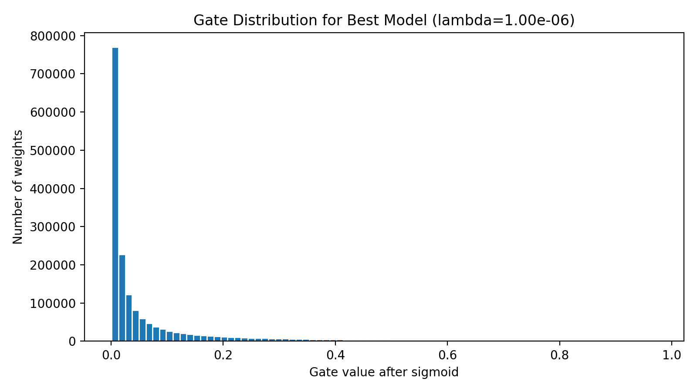

# Self-Pruning Neural Network Report

## Why an L1 penalty on sigmoid gates encourages sparsity

Each gate contributes directly to the objective through `lambda * sum(sigmoid(gate_scores))`.
That means every partially open connection pays a linear cost simply for staying active.
During optimization, a weight keeps its gate open only if the classification gain offsets that cost.
Connections that do not help enough are pushed toward smaller sigmoid values, which makes them easy to prune with a small threshold after training.

## Experimental Setup

- Dataset: CIFAR-10
- Epochs per lambda: 10
- Batch size: 128
- Hidden dimensions: [512, 256, 128]
- Base learning rate: 0.001
- Gate learning-rate multiplier: 10.0
- Reported accuracy: hard-pruned test accuracy using a gate threshold of `0.01`
- Best model selected by highest hard-pruned test accuracy: `lambda=1.00e-06`

## Results

| Lambda | Test Accuracy (%) | Sparsity Level (%) |
| --- | ---: | ---: |
| `1.00e-06` | 56.65 | 38.28 |
| `5.00e-06` | 55.93 | 78.69 |
| `1.00e-05` | 54.72 | 88.17 |

## Best Model Gate Distribution

A successful pruning run should show many gates clustered near zero, while the remaining useful connections stay noticeably above the pruning threshold.
